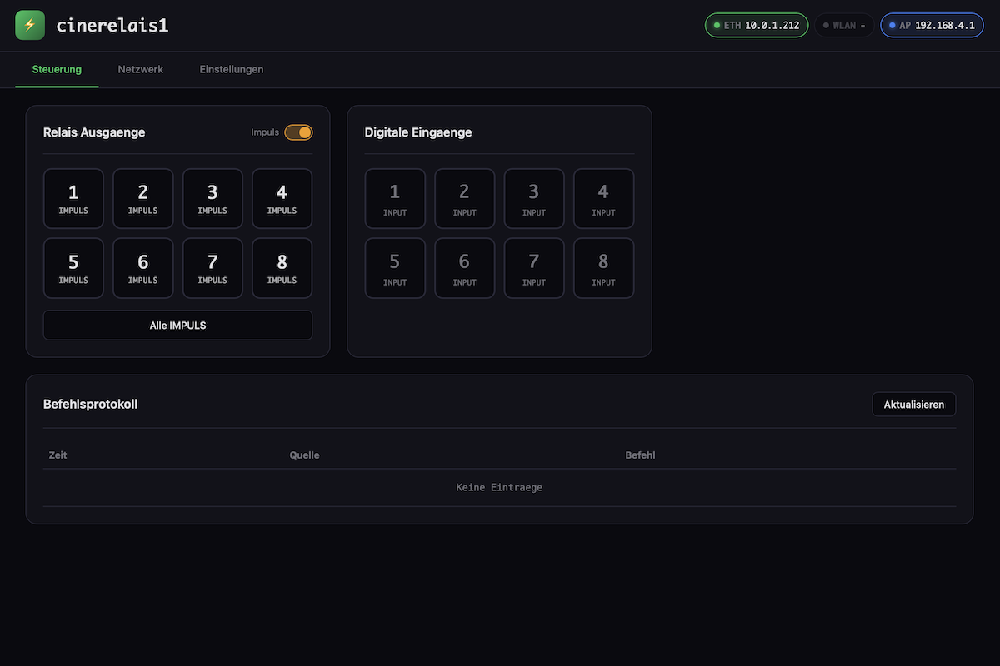

# CineRelais Module — ESP32-S3 Relay Controller

**[Deutsch](README.md)** | English

Firmware for the Waveshare ESP32-S3-ETH-8DI-8RO / ESP32-S3-POE-ETH-8DI-8RO module with web interface, TCP control, WiFi support and OTA updates.



## Features

- **Ethernet (W5500)** with DHCP or static IP
- **WiFi** — AP mode for initial setup, optional STA mode
- **Web interface** for configuration and control
- **TCP command interface** for relay control
- **OTA firmware updates** via web interface
- **8 Digital inputs** (optocoupler-isolated)
- **8 Relay outputs** via TCA9554 I2C expander
- **Input→Relay mapping** — inputs can directly control relays (hall control)
- **Modbus RS485** — support for external relay modules
- **Custom labels** for relays and inputs
- **RGB status LED** (WS2812) showing network and activity status
- **NTP time synchronization** with configurable timezone
- **Command log** (last 50 commands with timestamp)

## Installation

### Prerequisites

- [PlatformIO](https://platformio.org/) (recommended) or Arduino IDE
- USB-C cable for initial programming

### With PlatformIO

```bash
# Compile
pio run

# Upload firmware
pio run -t upload

# Upload filesystem (web interface)
pio run -t uploadfs

# Serial monitor (115200 baud)
pio device monitor
```

### With Arduino IDE

1. Install ESP32 Board Support (v3.x)
2. Install required libraries:
   - ArduinoJson (^7.0.0)
   - ElegantOTA (^3.1.0)
   - AsyncTCP (^1.1.1)
   - ESPAsyncWebServer (^1.2.3)
3. Select board: "ESP32S3 Dev Module"
4. Open `src/main.cpp` as `.ino` file
5. Upload

## Hardware

### Pin Mapping

#### Digital Inputs (DI1-DI8)
Optocoupler-isolated, active LOW with internal pull-up.

| Input | GPIO |
|-------|------|
| DI1   | 4    |
| DI2   | 5    |
| DI3   | 6    |
| DI4   | 7    |
| DI5   | 8    |
| DI6   | 9    |
| DI7   | 10   |
| DI8   | 11   |

#### Relay Outputs (RO1-RO8)
Controlled via **TCA9554 I2C I/O Expander** (address 0x20).

| I2C | GPIO |
|-----|------|
| SDA | 42   |
| SCL | 41   |

The 8 relays (RO1-RO8) are controlled via TCA9554 pins P0-P7.

#### Ethernet (W5500 SPI)
| Signal | GPIO |
|--------|------|
| SCLK   | 15   |
| MOSI   | 13   |
| MISO   | 14   |
| CS     | 16   |
| INT    | 12   |

#### Additional Peripherals
| Function   | GPIO |
|------------|------|
| RS485 TX   | 17   |
| RS485 RX   | 18   |
| RGB LED    | 38   |
| Buzzer     | 46   |

## Usage

### Initial Setup

1. Upload firmware and filesystem
2. The module starts a WiFi Access Point:
   - SSID: `cinerelais1` (= hostname)
   - Password: open (no password)
3. Connect to the AP and open `http://192.168.4.1`
4. Configure Ethernet/WiFi in the web interface
5. Restart the device

### Web Interface

After startup, the web interface is available at:
- **Ethernet**: IP from DHCP or configured static IP
- **WiFi AP**: `http://192.168.4.1`
- **WiFi STA**: IP from DHCP or configured static IP

**Features:**
- Toggle relays on/off (click) or pulse (right-click)
- Pulse mode: all clicks trigger pulses
- Control all relays at once
- Custom labels for relays and inputs
- Input→Relay mapping for hall control (500ms debounce)
- Modbus RS485 for external relay modules
- Ethernet configuration (DHCP/static IP)
- WiFi configuration (AP/STA, DHCP/static IP)
- NTP timezone selection via dropdown
- System information (hardware, network, uptime)
- OTA firmware update

### TCP Commands

Connect with a TCP client (e.g. `nc`, `telnet`) to the configured port (default: 5000).

| Command | Description |
|---------|-------------|
| `r1_on` ... `r8_on` | Turn relay on |
| `r1_off` ... `r8_off` | Turn relay off |
| `r1_pulse` | Pulse relay (default duration) |
| `r1_pulse_1000` | Pulse relay for 1000ms |
| `all_on` | Turn all relays on |
| `all_off` | Turn all relays off |
| `all_pulse` | Pulse all relays |
| `all_pulse_500` | Pulse all relays for 500ms |
| `status` | JSON status of all I/O |
| `help` | Show help |

**Examples:**

```bash
# Connect with netcat
nc 192.168.1.100 5000

# Turn relay 1 on
r1_on

# Pulse relay 3 for 1000ms
r3_pulse_1000

# Turn all relays off
all_off

# Query status
status
```

### Input→Relay Mapping (Hall Control)

Inputs can be configured to control specific relays — ideal for cinema hall control buttons:

- Configure in web interface under **Settings → Input→Actions**
- Multiple relays can be selected per input (checkboxes)
- Relays are active as long as the input is active
- **500ms debounce** prevents flickering from noisy signals
- Changes take effect immediately (no restart required)

**Example use case:**
- Input 1 (Hall button "Lights On") → Relay 1 + 2
- Input 2 (Hall button "Lights Off") → no assignment
- Input 3 (Curtain button) → Relay 5

### Modbus RS485

External relay modules can be controlled via Modbus RTU (RS485):

- **Connection:** TX=GPIO17, RX=GPIO18
- **Baud rate:** 9600
- **Address range:** 1-247 (automatic scan available)
- **Supported modules:** 6 or 8 relays

TCP commands for Modbus relays:
```bash
m1_r1_on        # Turn Modbus relay 1 on
m1_r3_pulse     # Pulse Modbus relay 3
m1_all_off      # Turn all Modbus relays off
modbus_scan     # Scan for Modbus device
```

### OTA Updates

1. Open web interface
2. Click "OTA Firmware Update"
3. Login: User `admin`, Password `flash`
4. Select `.bin` file and upload
5. Device restarts automatically

### Status LED

The RGB LED (WS2812 on GPIO 38) shows various states:

| Color | Pattern | Meaning |
|-------|---------|---------|
| Green | Solid | Ethernet connected |
| Cyan | Solid | WiFi STA connected |
| Blue | Pulsing | WiFi AP only active |
| Red | Fast blinking | No network connection |
| Orange | Brief flash | Command received |
| Yellow | Brief flash | Relay activity |
| Purple | Pulsing | OTA update in progress |

LED brightness is configurable in the web interface (default: 20%).

## Configuration

### Default Values

| Parameter | Default |
|-----------|---------|
| Hostname | cinerelais1 |
| DHCP (Ethernet) | Enabled |
| WiFi | Enabled |
| WiFi AP | Enabled |
| WiFi AP Password | (open) |
| TCP Port | 5000 |
| Pulse Duration | 500 ms |
| Static IP | 192.168.1.100 |
| NTP | Enabled |
| NTP Server | pool.ntp.org |
| Timezone | CET-1CEST (Europe/Berlin) |
| LED | Enabled |
| LED Brightness | 20% |

### Changing Configuration

All settings can be changed via the web interface. Configuration is stored in flash memory (LittleFS) as `/config.json`.

**Important:** A restart is required after changing network settings!

## API Endpoints

| Endpoint | Method | Description |
|----------|--------|-------------|
| `/api/status` | GET | Current status (JSON) |
| `/api/config` | GET | Current configuration (JSON) |
| `/api/config` | POST | Save configuration |
| `/api/relay` | POST | Control single relay |
| `/api/relays` | POST | Control all relays |
| `/api/log` | GET | Command log (last 50 entries) |
| `/api/restart` | POST | Restart device |
| `/update` | GET | OTA update page |

### API Examples

```bash
# Query status
curl http://192.168.1.100/api/status

# Turn relay 1 on
curl -X POST -d "relay=1&state=on" http://192.168.1.100/api/relay

# Pulse relay 2 for 2000ms
curl -X POST -d "relay=2&state=pulse&duration=2000" http://192.168.1.100/api/relay

# Turn all relays off
curl -X POST -d "state=off" http://192.168.1.100/api/relays

# Configure WiFi SSID
curl -X POST -d "wifiSSID=MyNetwork&wifiPassword=secret" http://192.168.1.100/api/config
```

## Troubleshooting

### TCA9554 Not Found
- Check I2C connection (SDA=GPIO42, SCL=GPIO41)
- Check serial monitor for "TCA9554 found at 0x20"
- If not found: check board hardware

### No Ethernet Connection
- Check Ethernet cable
- Check PoE power supply (if POE version)
- Check serial monitor for "ETH Got IP"

### WiFi AP Not Visible
- Check if WiFi is enabled in configuration
- Check if WiFi AP is enabled
- Hostname = SSID of the Access Point

### Web Interface Not Reachable
- Check IP address in serial monitor
- For WiFi AP: use `192.168.4.1`
- Clear browser cache

## License

MIT License
